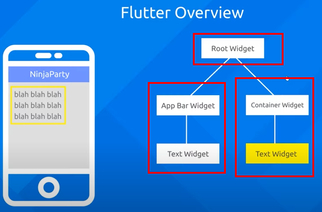

# Learning flutter essentials
> Flutter allows you to build apps for mobile, web, desktop, and embedded devices — all from a single codebase.

> Native performance : Flutter compiles down to native machine code for fast apps and beautiful animations.

> Hot reload : Flutter’s hot reload feature helps you quickly and easily experiment, build UIs, add features, and fix bugs. Hot reload works by injecting updated source code files into the running Dart Virtual Machine (VM). After the VM updates classes with the new versions of fields and functions, the Flutter framework automatically rebuilds the widget tree, allowing you to quickly view the effects of your changes.

> Customize every pixel : The Flutter rendering engine lets you control every pixel, and its widget library automatically adapts to any screen.

## Flutter overview
The builing blocks of flutter is a widget.

