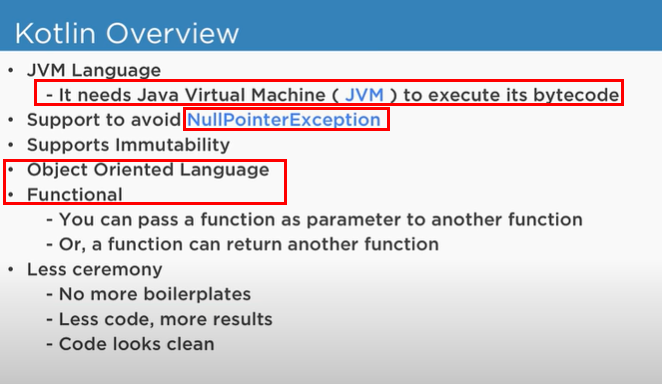
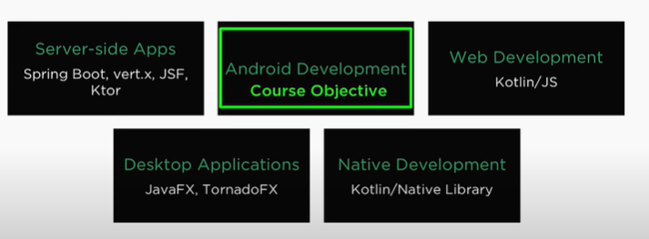
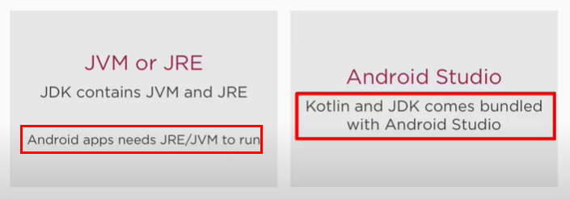

# Learning Kotlin Essentials
Took below course and summarized essentials. 

- [Kotlin Course for Beginners and Java Devs](https://www.youjahstube.com/watch?v=k9K71QkrHGE&list=PLrnPJCHvNZuAIbejjZA1kGfLeA8ZpICB2&index=1)

Why learn Kotlin? Kotlin version 1.0 is released 2016, improving pain points of Java. Java has been very commonly used language but even a lot of Java developers admitted Kotlin is a great alternative to Java. 

One of the pain points in Java was a null point error, which was the cause to crash an entire app even during runtime. Kotlin fixed this by throwing the error before runtime just like Typescript enables a compiler-time debugging. 

Furthermore, Kotlin was chosen for offical Android language over other languages. ... So to simply put, learn it! 

## Types of Kotlin application
What you can do with Kotlin is as follows. 

## Development environment
To develop application in Kotlin, go install Android Studio. Android apps require JRE/JVM and Android Studio comes with it. 

> Android Studio is the official Integrated Development Environment (IDE) for Android app development, based on IntelliJ IDEA . On top of IntelliJ's powerful code editor and developer tools, Android Studio offers even more features that enhance your productivity when building Android apps.

## Reference
- [Android Kotlin Tutorial: Create Android Apps using Kotlin](https://www.youtube.com/watch?v=CsxpHOQKk8c&list=PLlxmoA0rQ-Lw5k_QCqVl3rsoJOnb_00UV&index=2)
- [Kotlin Course for Beginners and Java Devs](https://www.youtube.com/watch?v=k9K71QkrHGE&list=PLrnPJCHvNZuAIbejjZA1kGfLeA8ZpICB2&index=1)
