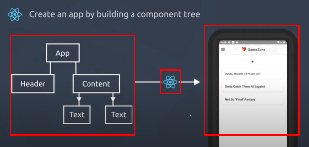
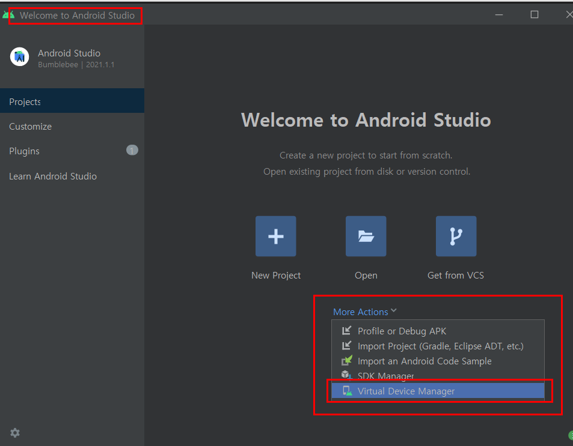
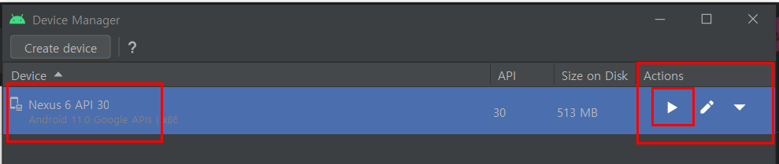

# Learning React Native Essentials
> Many different kinds of people use React Native: from advanced iOS developers to React beginners, to people getting started programming for the first time in their career. These docs were written for all learners, no matter their experience level or background.

> To work with React Native, you will need to have an understanding of JavaScript fundamentals. If you’re new to JavaScript or need a refresher, you can dive in or brush up at Mozilla Developer Network.

## Basics
> With React, you can make components using either classes or functions. Originally, class components were the only components that could have state. But since the introduction of React's Hooks API, you can add state and more to function components.

> Hooks were introduced in React Native 0.59., and because Hooks are the future-facing way to write your React components, we wrote this introduction using function component examples. Where useful, we also cover class components under a toggle like so:

```jsx 
import { Text, View } from 'react-native';
// functional component
const HelloWorldApp = () => {
  return (
    <View style={{
        flex: 1,
        justifyContent: 'center',
        alignItems: 'center'
      }}>
      <Text>Hello, world!</Text>
    </View>
  );
}

export default HelloWorldApp;

// class component
import React, { Component } from 'react';
import { Text, View } from 'react-native';

class HelloWorldApp extends Component {
  render() {
    return (
      <View style={{
          flex: 1,
          justifyContent: "center",
          alignItems: "center"
        }}>
        <Text>Hello, world!</Text>
      </View>
    );
  }
}

export default HelloWorldApp;
```

## Core component and native component
> React Native is an open source framework for building Android and iOS applications using React and the app platform’s native capabilities. With React Native, you use JavaScript to access your platform’s APIs as well as to describe the appearance and behavior of your UI using React components: bundles of reusable, nestable code. You can learn more about React in the next section. But first, let’s cover how components work in React Native.


## How React Native works
React native compiles your components into native codes such as Android and IOS. 



## Getting started
> If you are new to mobile development, the easiest way to get started is with Expo CLI. Expo is a set of tools built around React Native and, while it has many features, the most relevant feature for us right now is that it can get you writing a React Native app within minutes. You will only need a recent version of Node.js and a phone or emulator. If you'd like to try out React Native directly in your web browser before installing any tools, you can try out Snack.

Install Expo CLI like below to get started. 

```shell
$npm install -g expo-cli
```

And then create your Expo project like below. 

```shell
$expo init your-project-name-here
```

To test your React Native app, both IOS and Android clients are needed. Use Expo client for IOS and use Android Studio for Android. 

Once Android Studio installed, adjust setting for Adroid Virtual Devices. 



Choose/install device/API based on your needs and then click action to start the device. 



And then, in Expo application, click "Run on Android device/emulator" to connect your Expo app and Android virutal device manager. Then it will automatically install what needs to be installed(e.g Javascript bundle)


### Basic components
- View : The fundamental component of React Native.
> The most fundamental component for building a UI, View is a container that supports layout with flexbox, style, some touch handling, and accessibility controls. View maps directly to the native view equivalent on whatever platform React Native is running on, whether that is a UIView, <div>, android.view, etc. 

- Text : Text should be rendered in Text component. 
> In React Native, we are more strict about it: you must wrap all the text nodes inside of a <Text> component. You cannot have a text node directly under a <View>.
> The <Text> element is unique relative to layout: everything inside is no longer using the Flexbox layout but using text layout. This means that elements inside of a <Text> are no longer rectangles, but wrap when they see the end of the line.

- Style : React Native does not use CSS since IOS and Android do not support CSS. So React Native deals with this by emulating CSS id only and then convert to what each native platform support. Note that styles are not automatically inherited between components unless it is Text in Text. 

```jsx
// View style does not apply to Text comp.
<View style={{color : "white"}}>
    <Text>Not color white here</Text>
</View>

// Text style applies to Text comp.
<Text style={{color : "white"}}>
    color white here
    <Text> color white here, too </Text>
</Text>
```

## Reference 
- [React Native](https://reactnative.dev/docs/environment-setup)
- [React Native Tutorial for Beginners](https://www.youtube.com/watch?v=ur6I5m2nTvk&list=PL4cUxeGkcC9ixPU-QkScoRBVxtPPzVjrQ&index=1)