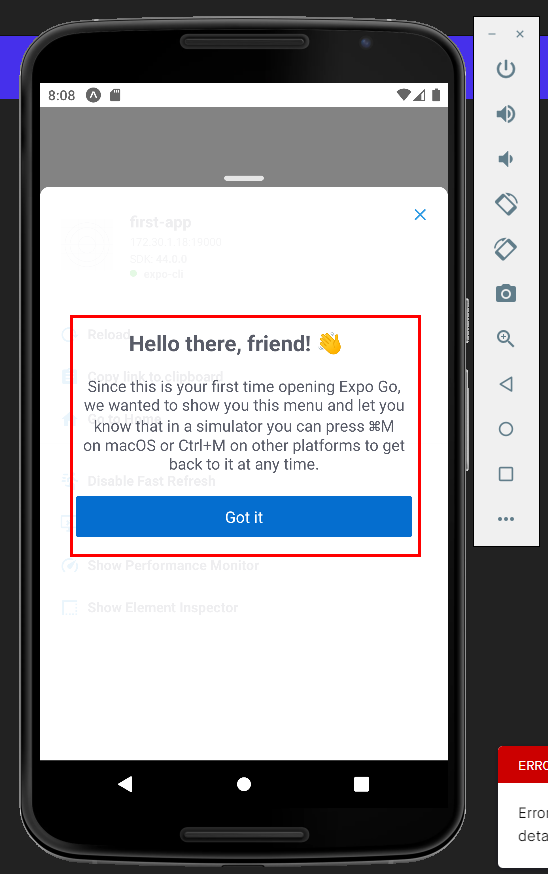

# Learning React Native Essentials
Took below course and summarized essentials. 

- [React Native Tutorial for Beginners](https://www.youtube.com/watch?v=ur6I5m2nTvk&list=PL4cUxeGkcC9ixPU-QkScoRBVxtPPzVjrQ&index=1)

## How React Native works
React native compiles your components into native codes such as Android and IOS. 


## Getting started
> If you are new to mobile development, the easiest way to get started is with Expo CLI. Expo is a set of tools built around React Native and, while it has many features, the most relevant feature for us right now is that it can get you writing a React Native app within minutes. You will only need a recent version of Node.js and a phone or emulator. If you'd like to try out React Native directly in your web browser before installing any tools, you can try out Snack.

Install Expo CLI like below to get started. 

```shell
$npm install -g expo-cli
```

And then create your Expo project like below. 

```shell
$expo init your-project-name-here
```

To test your React Native app, both IOS and Android clients are needed. Use Expo client for IOS and use Android Studio for Android. 

Once Android Studio installed, adjust setting for Adroid Virtual Devices. 


Choose/install device/API based on your needs and then click action to start the device. 


And then, in Expo application, click "Run on Android device/emulator" to connect your Expo app and Android virutal device manager. Then it will automatically install what needs to be installed(e.g Javascript bundle)



### Basic components
- View : The fundamental component of React Native.
> The most fundamental component for building a UI, View is a container that supports layout with flexbox, style, some touch handling, and accessibility controls. View maps directly to the native view equivalent on whatever platform React Native is running on, whether that is a UIView, <div>, android.view, etc. 

- Text : Text should be rendered in Text component. 
> In React Native, we are more strict about it: you must wrap all the text nodes inside of a <Text> component. You cannot have a text node directly under a <View>.
> The <Text> element is unique relative to layout: everything inside is no longer using the Flexbox layout but using text layout. This means that elements inside of a <Text> are no longer rectangles, but wrap when they see the end of the line.

- Style : React Native does not use CSS since IOS and Android do not support CSS. So React Native deals with this by emulating CSS id only and then convert to what each native platform support. Note that styles are not automatically inherited between components unless it is Text in Text. 

```jsx
// View style does not apply to Text comp.
<View style={{color : "white"}}>
    <Text>Not color white here</Text>
</View>

// Text style applies to Text comp.
<Text style={{color : "white"}}>
    color white here
    <Text> color white here, too </Text>
</Text>
```

## Reference 
- [React Native](https://reactnative.dev/docs/environment-setup)